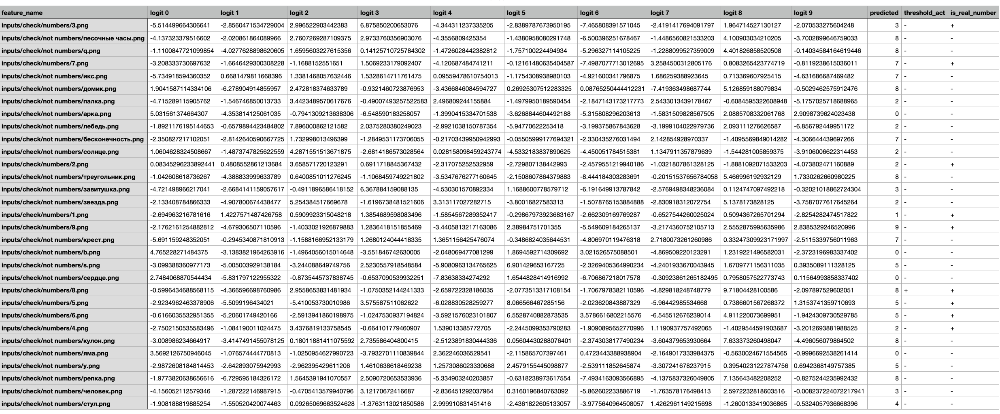

Detect Writed Number 2.0 ***(learning)***
----------------
~~Что за проект? Что он делает?~~

**Detect Writed Number** - задача по распознаванию рукописных [цифр][3]. В общем смысле ее можно разбить на две части: [обучение и сохранение модели с настроенными весами][1] и [графическое окно для рисования цифры][2].

~~Таких проектов миллион. Не изобретай велосипед и используй Feature Extraction.~~

Поскольку подобных задач в сети куча, то в каком-то смысле ее стоит рассматривать с точки зрения тренировки и опыта. _Pet project_.


Example:
----------------
**Input:**


**Output:**

`[INFO]	User painted '7'`

Описание:
----------------
Основная часть проекта. Вкратце о том, что происходит в предыдущей части:
1. Обучение модели на датасете **MNIST**;
2. Тестирование модели;
3. Сохранение модели в формате **.pt**  `torch.save(mnist_net, 'mnist_full_model.pt')`.

...Последний пункт плавно перетекает в текущую часть проекта.
В данной части реализация окна для рисования, распознавания и сохранения нарисованного изображения.

- ### Датасет:

Поскольку стоит задача распознавания рукописных цифр, то для нее отлично подойдет MNIST-датасет, имеющий 60'000 тренировочных и 10'000 тестовых одноканальных изображений с расширением 28x28. Тренировочный датасет поделим на train и val в соотрошении 9:1 соответственно. 
Благодаря тому, что MNIST-датасет сбалансированный(все классы имеют одинаковое количество фич), то можно использовать acc как основную метрику. Именно по ней будем ориентироваться и выберем лучшие веса при лучшем accuracy.

- ### Архитектура CNN:

Архитектура использует несколько идущих подряд блоков из conv-слоя батч-нормализации, LeakyReLU и max-пуллинга, в конце применяется несколько линейных слоев с ReLU. Подробнее в файле [MNISTNet.py][8].

Хоть и можно было воспользоваться методом Feature Extraction, разморозить последний слой и дообучить тот же самый ResNet. Но было принято решение реализовать собственноручно архитектуру нейросети.


- ### Гиперпараметры:

Путем длительного подбора оптимальных параметров было установлено, что нейросеть лучше всего обучается при:

1. оптимизатор модели: ` learning_rate=5e-4`
2. размер батча: `batch_size=50`
3. Conv2d: `kernel_size=3` и `padding=1(и еще 0)`
4. MaxPool2d: `kernel_size=2` и `stride=2`

- ### Train/Validation:

Тренировка и валидация проходят в однй функции - train, сначала проходит эпоха для обучения, а потом - для валидации. На каждой фазе вычисляются такие метрики, как acc, loss, precision, recall, F-мера и macro F-мера. Пример:
```
...
----------
Epoch 39/40
Phase: train; Loss: 0.0027, Acc: 0.9999, Pre: 0.9993, Rec: 0.9993, macro-avr F1: 0.9993, avr F1: 0.9993
Phase: val; Loss: 0.0546, Acc: 0.9985, Pre: 0.9923, Rec: 0.9922, macro-avr F1: 0.9922, avr F1: 0.9922
Epoch time = 0:00:31.609002
----------
...
```

В процессе обучения запоминаются веса, при которых был лучший accuracy на валидационной выборке.

- ### Test:

В функции test вычисляются такие же метрики, как и в train. Еще добавляется коллекция **maximum_class_probabilities** для вычисления доверительного порога для нейросети. Поскольку выход не нормируется софтмаксом, то можно будет хранить выход из нейросети, когда **predict==label**. После прохождения по всей тестовой выборке, находим доверительный интервал с **alpha=0.95**.
После расчета доверительного интервала выбираем минимальное значение и сохраняем его с именем `trusted_threshold` в файл outputs/data.json

- ### Model processing:

Данная часть реализована в файле [processing.py][9]. Обученная модель подгружается и используется для анализа собственно составленного небольшого датасета в папке **inputs/**. Эта папка содержит 2 подкаталога:

##### inputs/test/:
Содержит лейблы для сравнения и можно посчитать метрики.

##### inputs/check/:
Не содержит лейблы, разделена на часть, где есть цифры, и где их нет, но есть похожие на цифры предметы.

После выполнения данной процедуры будут сформированы файлы **outputs/test.csv** и **outputs/check.scv** с полезной информацией, которую выдала нейросеть.

Пример: 


Пример:



- ### Model tracing:

Поскольку [вторая часть][2] написана на С++, то необходимо подружить обученную модель на python с оконным приложением на С++. Это можно сделать благодаря библиотеке `TorchScript`, которая скриптует/трассирует модель. И в таком виде обученную модель можно считать кросс-языковой.

Заключение:
----------------
Модель дает accuracy=0.9990 на тестовой выборке, что является довольно неплохим результатом для задачи MNIST-датасета.

Скрин изменения acc и loss:


Как видно, после 22-й эпохи начинает расти loss. Значит, модель начала переобучаться, поэтому стоит приостановить обучение на этом этапе.

##### Пункты, которыми проект будет дополняться со временем:

1. Поддержка расширенных настроек через конфигурационный файл.
2. Логгирование полезной информации.
3. Работа из-под коробки. Скачали, собрали, запустили, нарисовали.
4. Поддержка скриптования предобученных классических нейросетей для сравнения. **Feature Extraction**.

[1]: https://github.com/AidarAzizov/DetectWritedNumber_learning
[2]: https://github.com/AidarAzizov/DetectWritedNumber_runner
[3]: https://ru.wikipedia.org/wiki/Цифры
[4]: https://ru.wikipedia.org/wiki/Размытие_по_Гауссу
[5]: https://gamedev.ru/code/terms/Bounding_Box
[6]: https://ru.wikipedia.org/wiki/Аффинное_преобразование
[7]: http://yann.lecun.com/exdb/mnist/
[8]: https://github.com/AidarAzizov/DetectWritedNumber_learning/blob/master/MNISTNet.py
[9]: https://github.com/AidarAzizov/DetectWritedNumber_learning/blob/master/processing.py